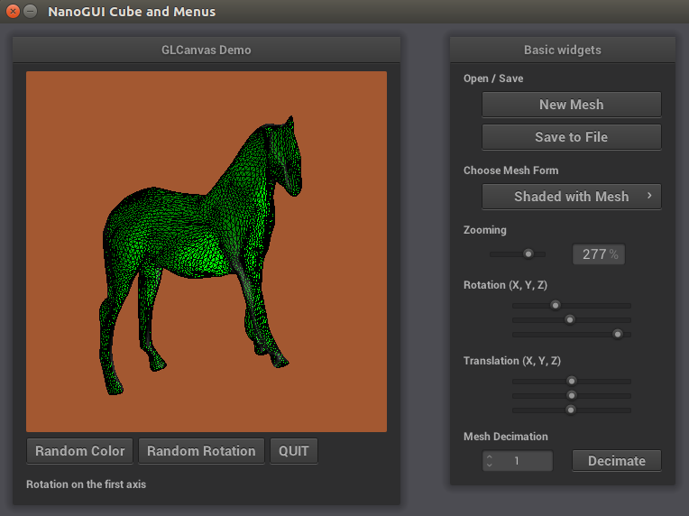
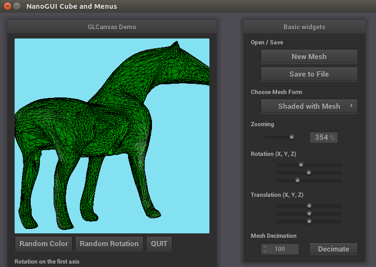

# 3D Mesh Decimation
Quadric-based Mesh Decimation Via Multiple Choices Algorithm

## Getting Started
This code is the impelementation of a mesh decimation algorithm based on the quadric-based errors with winged edge data structure. Since the input mesh is assumed as a closed manifold triangle mesh, I've implemented only edge collapse, not vertex pair collapse. Multiple choice scheme is used for the outer optimization. 
 
 This code is implemented based on two papers:["Surface Simplification Using Quadric Error Metrics"](http://mgarland.org/files/papers/quadrics.pdf),and ["Fast Mesh Decimation by Multiple-Choice Techniques"](http://www.graphics.rwth-aachen.de/media/papers/mcd_vmv021.pdf). 
 Also, [NanoGUI](https://nanogui.readthedocs.io/en/latest/) is used to render the object, the first sample codes for nanugui is provided by [Wallace Lira](http://www.sfu.ca/~wpintoli/) but most of them are modified in this code.


### Prerequisites
This code is implemented with C++11 and tested on Linux 16.04. Nanogui is already included in this code directory. 

### Run
```
cd <path-to-folder>
cmake .
make
./mcaq
```
you can import example meshes from ./objs directory using NanoGUI interface.

## Result
Before decimation,



After decimation, 



## Author

Suhong Kim – [@github](https://github.com/suhongkim) – suhongkim11@gmail.com \
Distributed under the MIT license. See the [LICENSE.md](LICENSE.md) file for details

## Inspiration
This project is done  for CMPT764 ["Geometry Modeling in Computer Graphics"](https://www2.cs.sfu.ca/~haoz/teaching/cmpt464/index.html)(Spring2019) at SFU. 
